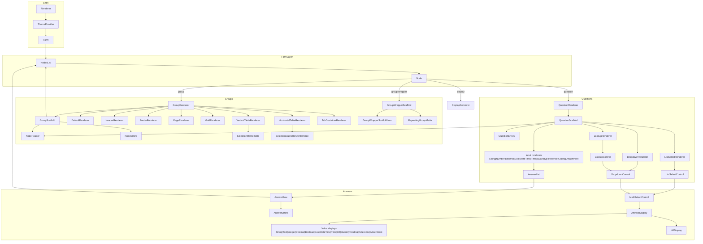
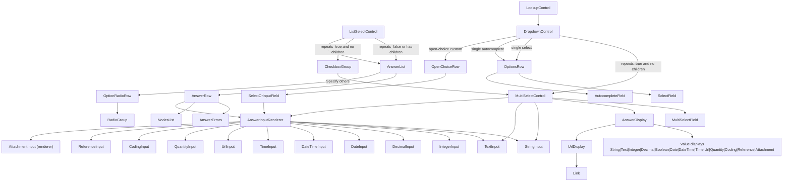
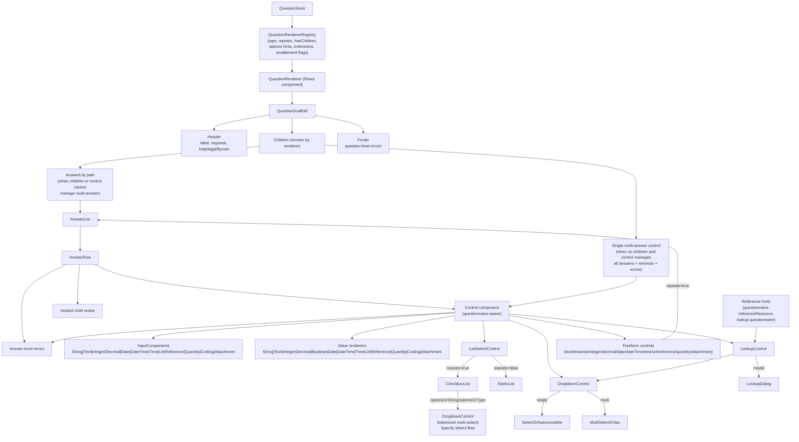

# Aidbox Forms Renderer

Minimal React renderer for HL7® FHIR® Questionnaires

```tsx
import {
  Renderer,
  type Questionnaire,
  type QuestionnaireResponse,
} from "@aidbox-forms/renderer";
import { theme } from "@aidbox-forms/hs-theme";
import { useState } from "react";

const questionnaire: Questionnaire = {
  resourceType: "Questionnaire",
  item: [
    { linkId: "first", text: "First name", type: "string", required: true },
    { linkId: "consent", text: "Consent to treatment", type: "boolean" },
  ],
};

export function IntakeForm() {
  const [response, setResponse] = useState<QuestionnaireResponse | null>(null);

  return (
    <Renderer
      questionnaire={questionnaire}
      initialResponse={response ?? undefined}
      onChange={setResponse}
      onSubmit={setResponse}
      theme={theme}
    />
  );
}
```

To swap to the NHS look and feel, import from `@aidbox-forms/nshuk-theme`:

```tsx
import { theme } from "@aidbox-forms/nshuk-theme";

<Renderer questionnaire={questionnaire} theme={theme} />;
```

## Renderer Component Topology



## Renderer to Theme Boundary

```mermaid
flowchart LR
  subgraph Renderer
    Form
    DisplayRenderer
    QuestionScaffold
    GroupScaffold
    GroupWrapperScaffold
    GroupWrapperScaffoldItem
    AnswerList
    AnswerRow
    SelectionMatrixTable
    SelectionMatrixHorizontalTable
    GridRenderer
    MultiSelectControl
    DropdownControl
    ListSelectControl
    UrlDisplay
    AttachmentInputRenderer["AttachmentInput (renderer)"]
  end

  subgraph Theme
    FormTheme["Form (theme)"]
    FormHeader
    FormErrors
    NodeListTheme["NodeList (theme)"]
    FormSection
    PageStatus
    PageNavigation
    FormActions
    Button
    DisplayRendererTheme["DisplayRenderer (theme)"]
    QuestionScaffoldTheme["QuestionScaffold (theme)"]
    NodeHeaderTheme["NodeHeader (theme)"]
    OptionsState
    ErrorsTheme["Errors (theme)"]
    GroupScaffoldTheme["GroupScaffold (theme)"]
    GroupWrapperScaffoldItemTheme["GroupWrapperScaffoldItem (theme)"]
    GroupWrapperScaffoldTheme["GroupWrapperScaffold (theme)"]
    GridTable
    SelectionMatrix
    AnswerListTheme["AnswerList (theme)"]
    AnswerRowTheme["AnswerRow (theme)"]
    SelectField
    AutocompleteField
    RadioGroup
    CheckboxGroup
    MultiSelectField
    Link
    AttachmentInput
  end

  Form --> FormTheme
  Form --> FormHeader
  Form --> FormErrors
  Form --> NodeListTheme
  Form --> FormSection
  Form --> PageStatus
  Form --> PageNavigation
  Form --> FormActions
  Form --> Button

  DisplayRenderer --> DisplayRendererTheme
  QuestionScaffold --> QuestionScaffoldTheme
  QuestionScaffold --> NodeHeaderTheme
  QuestionScaffold --> OptionsState
  QuestionScaffold --> ErrorsTheme
  GroupScaffold --> GroupScaffoldTheme
  GroupScaffold --> NodeHeaderTheme
  GroupScaffold --> NodeListTheme
  GroupScaffold --> ErrorsTheme
  GroupWrapperScaffold --> GroupWrapperScaffoldTheme
  GroupWrapperScaffold --> Button
  GroupWrapperScaffoldItem --> GroupWrapperScaffoldItemTheme

  AnswerList --> AnswerListTheme
  AnswerList --> Button
  AnswerRow --> AnswerRowTheme
  AnswerRow --> Button
  AnswerRow --> ErrorsTheme

  GridRenderer --> GridTable
  SelectionMatrixTable --> SelectionMatrix
  SelectionMatrixHorizontalTable --> SelectionMatrix

  DropdownControl --> SelectField
  DropdownControl --> AutocompleteField
  ListSelectControl --> RadioGroup
  ListSelectControl --> CheckboxGroup
  MultiSelectControl --> MultiSelectField

  UrlDisplay --> Link
  AttachmentInputRenderer --> AttachmentInput
```



## Renderer Question Renderers (Detailed)

```mermaid
flowchart TD
  QuestionStore --> QuestionControlRegistry

  QuestionControlRegistry -->|options + list control| ListSelectRenderer
  QuestionControlRegistry -->|options + lookup| LookupRenderer
  QuestionControlRegistry -->|options + autocomplete/select| DropdownRenderer
  QuestionControlRegistry -->|optionsOrString/optionsOrType| DropdownRenderer
  QuestionControlRegistry -->|boolean| ListSelectRenderer
  QuestionControlRegistry -->|string/text/url| StringRenderer
  QuestionControlRegistry -->|integer| NumberRenderer
  QuestionControlRegistry -->|decimal| DecimalRenderer
  QuestionControlRegistry -->|date| DateRenderer
  QuestionControlRegistry -->|dateTime| DateTimeRenderer
  QuestionControlRegistry -->|time| TimeRenderer
  QuestionControlRegistry -->|quantity| QuantityRenderer
  QuestionControlRegistry -->|coding| CodingRenderer
  QuestionControlRegistry -->|reference| ReferenceRenderer
  QuestionControlRegistry -->|attachment| AttachmentRenderer
  QuestionControlRegistry -->|fallback| UnsupportedRenderer

  ListSelectRenderer -.-> QuestionScaffold
  DropdownRenderer -.-> QuestionScaffold
  LookupRenderer -.-> QuestionScaffold
  StringRenderer -.-> QuestionScaffold
  NumberRenderer -.-> QuestionScaffold
  DecimalRenderer -.-> QuestionScaffold
  DateRenderer -.-> QuestionScaffold
  DateTimeRenderer -.-> QuestionScaffold
  TimeRenderer -.-> QuestionScaffold
  QuantityRenderer -.-> QuestionScaffold
  CodingRenderer -.-> QuestionScaffold
  ReferenceRenderer -.-> QuestionScaffold
  AttachmentRenderer -.-> QuestionScaffold
  UnsupportedRenderer -.-> QuestionScaffold

  QuestionScaffold --> NodeHeader
  QuestionScaffold --> OptionsState
  QuestionScaffold --> QuestionErrors

  ListSelectRenderer --> ListSelectControl
  DropdownRenderer --> DropdownControl
  LookupRenderer --> LookupControl --> DropdownControl

  StringRenderer --> AnswerList
  NumberRenderer --> AnswerList
  DecimalRenderer --> AnswerList
  DateRenderer --> AnswerList
  DateTimeRenderer --> AnswerList
  TimeRenderer --> AnswerList
  QuantityRenderer --> AnswerList
  CodingRenderer --> AnswerList
  ReferenceRenderer --> AnswerList
  AttachmentRenderer --> AnswerList
  UnsupportedRenderer --> UnsupportedBody["Unsupported type message"]
```



## Renderer Controls and Answer Flow (Detailed)



## To-Be Renderer Topology



Useful scripts: `npm run dev` (playground), `npm run build` (type-check + bundle), `npm test`, `npm run lint`.
Packages live under `packages/` and the workspace uses pnpm:

- Install deps: `pnpm install`
- Dev: `pnpm --filter @aidbox-forms/renderer dev`
- Build: `pnpm --filter @aidbox-forms/renderer build`
- Lint: `pnpm --filter @aidbox-forms/renderer lint`
- Typecheck: `pnpm --filter @aidbox-forms/renderer typecheck`

See [COVERAGE.md](COVERAGE.md) for the detailed SDC feature checklist.
