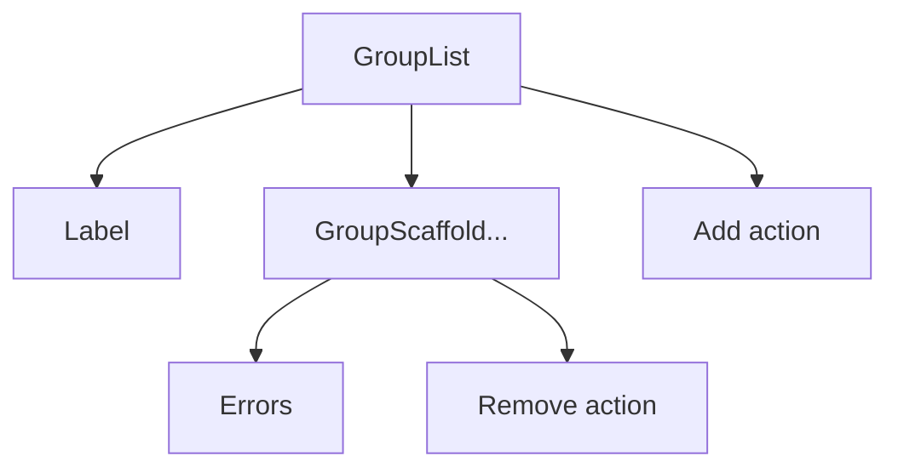

# @aidbox-forms/theme

## Table of Contents

- [Table of Contents](#table-of-contents)
- [Install](#install)
- [Quick start](#quick-start)
- [Theme contract](#theme-contract)
- [Conventions](#conventions)
- [Renderer composition overview](#renderer-composition-overview)
- [Accessibility contract](#accessibility-contract)
- [Controlled-value contract](#controlled-value-contract)
- [Disabled behavior](#disabled-behavior)
- [Options and custom options lifecycle](#options-and-custom-options-lifecycle)
- [Repeating items contract](#repeating-items-contract)
- [Renderer guarantees](#renderer-guarantees)
- [Component reference](#component-reference)
  - [Link](#link)
  - [Errors](#errors)
  - [OptionsLoading](#optionsloading)
  - [Help](#help)
  - [Legal](#legal)
  - [Flyover](#flyover)
  - [Label](#label)
  - [InputGroup](#inputgroup)
  - [TextInput](#textinput)
  - [TextArea](#textarea)
  - [NumberInput](#numberinput)
  - [DateInput](#dateinput)
  - [DateTimeInput](#datetimeinput)
  - [TimeInput](#timeinput)
  - [SliderInput](#sliderinput)
  - [SpinnerInput](#spinnerinput)
  - [SelectInput](#selectinput)
  - [RadioButton](#radiobutton)
  - [RadioButtonList](#radiobuttonlist)
  - [Checkbox](#checkbox)
  - [CheckboxList](#checkboxlist)
  - [MultiSelectInput](#multiselectinput)
  - [CustomOptionForm](#customoptionform)
  - [FileInput](#fileinput)
  - [AnswerRemoveButton](#answerremovebutton)
  - [AnswerList](#answerlist)
  - [AnswerScaffold](#answerscaffold)
  - [QuestionScaffold](#questionscaffold)
  - [GroupList](#grouplist)
  - [GroupScaffold](#groupscaffold)
  - [DisplayRenderer](#displayrenderer)
  - [Stack](#stack)
  - [Form](#form)
  - [Table](#table)
  - [TabContainer](#tabcontainer)
- [Data types](#data-types)
  - [FormPagination](#formpagination)
  - [OptionItem](#optionitem)
  - [SelectedOptionItem](#selectedoptionitem)
  - [CustomOptionAction](#customoptionaction)
  - [Attachment](#attachment)
  - [TableColumn](#tablecolumn)
  - [TableRow](#tablerow)
  - [TableCell](#tablecell)
  - [TabItem](#tabitem)

## Install

```bash
pnpm add @aidbox-forms/theme
```

## Quick start

Create a theme by implementing the Theme contract. You can start from a base theme and override only what you need.

```tsx
import type { Theme } from "@aidbox-forms/theme";
import Renderer from "@aidbox-forms/renderer";
import { theme as baseTheme } from "@aidbox-forms/hs-theme";

const theme: Theme = {
  ...baseTheme,
  Label: MyLabel,
};

<Renderer questionnaire={questionnaire} theme={theme} />;
```

## Theme contract

A Theme is a full object with React components for every slot listed in the component reference. The renderer never
touches DOM APIs directly, so the theme is responsible for markup, layout, and styling while keeping the data flow
purely through props.

You may create a complete theme from scratch or extend an existing one with object spread. The Theme type is strict, so
every component must be provided.

## Conventions

- Controlled props: text/number/date inputs use value and onChange. Single-selects pass selectedOption, multi-selects
  pass selectedOptions with onSelect/onDeselect, and checkbox lists use tokens for the selected set. onChange receives
  the next value, never a DOM event.
- Disabled states: the renderer uses disabled to indicate non-editable inputs. Prefer disabled over readOnly in theme
  components.
- Accessibility: ariaLabelledBy and ariaDescribedBy are string ids. Wire them to the relevant elements.
- Ids: when id is provided, pass it through to the focusable control.
- children is the slot name for single content. Option data types use label for the display content.
- Optional = Yes means the renderer may omit the prop at runtime; Optional = No means it is always passed. Treat undefined as not provided.

## Renderer composition overview

The renderer composes your theme in a predictable tree. You control layout, but the nesting explains where headers,
errors, and actions appear.

Overview diagram (simplified):

```mermaid
flowchart TD
  QS[QuestionScaffold] --> QH[Label]
  QS --> QOL[OptionsLoading]
  QS --> AL[AnswerList or control]
  AL --> AS[AnswerScaffold]
  AS --> CTRL[Control]
  AS --> RB[Remove action (AnswerRemoveButton)]
  AS --> CH[Children (Nodes)]
  AS --> AE[Errors]
  QS --> QE[Errors]
```



Typical question node:

```text
QuestionScaffold
  Label
  OptionsLoading (only when option-backed and isLoading)
  AnswerList (or a single control)
    AnswerScaffold (per answer)
      control (TextInput/Select/etc.)
      remove action (AnswerRemoveButton when repeats)
      children (nested nodes)
      errors (Errors)
  Errors (question-level)
```

Typical repeating group list:

```text
GroupList
  Label (only when list has text)
  GroupScaffold (per instance)
    remove action (when onRemove is provided)
    errors
  add action (when onAdd is provided)
```

Typical non-repeating group:

```text
GroupScaffold
  Label (when visible)
  Stack (child nodes)
  Errors
```

## Accessibility contract

- `ariaLabelledBy` and `ariaDescribedBy` are already-composed, space-separated id strings. Attach them verbatim to the
  focusable element; do not join or parse them.
- `Label` receives `id` for the label element id. Apply it to the element that wraps the visible label text so controls
  can reference it via `aria-labelledby`.
- When `id` is provided, set it on the primary focusable element. For composite widgets, choose the element that
  receives keyboard focus.
- `ariaDescribedBy` references the rendered `Help` and `Errors` ids. Keep those elements in the DOM when you render
  them. Legal and flyover content is not included in `ariaDescribedBy` by default, so ensure it remains accessible in
  your layout.
- For `TabContainer`, follow the WAI-ARIA tab pattern: `role="tablist"` on the container, `role="tab"` on each tab with
  `id={buttonId}`, `role="tabpanel"` on each panel with `id={panelId}`, and wire `aria-controls`/`aria-labelledby`.
- For custom select or multiselect widgets, follow standard combobox/listbox roles and keyboard interactions (Arrow
  keys, Enter/Space to select, Escape to close) when you are not using native inputs.

## Controlled-value contract

All inputs are controlled; callbacks receive values, not DOM events.

- TextInput/TextArea: pass the raw string; empty string stays empty string.
- NumberInput/SpinnerInput/SliderInput: parse to `number` or `undefined`. Use `undefined` when the field is empty or
  invalid; do not pass strings.
- DateInput/DateTimeInput/TimeInput: treat the value as an opaque string and return it as entered. Do not normalize,
  format, or shift timezones.
- Select/Radio: `selectedOption = undefined` means no selection. Call `onChange(token | undefined)` for changes.
- CheckboxList/MultiSelect: treat `selectedOptions[].token` as the selected set. Call `onSelect` or `onDeselect` once per
  user action and do not reorder the provided selections.

## Disabled behavior

- When `disabled` is true, render the UI as disabled and suppress all callbacks.
- Native inputs: use the `disabled` attribute.
- Custom widgets: set `aria-disabled="true"`, remove from the tab order (`tabIndex={-1}`), and ignore pointer/keyboard
  events.
- Disabled options should remain visible and announced as disabled.
- If an add/remove action is provided with `canAdd={false}` or `canRemove={false}`, render it disabled rather than
  hiding it.

## Options and custom options lifecycle

- Tokens are stable for a given option or selection; it is safe to use them as React keys.
- `SelectedOptionItem.label` may not match the current options list (legacy or custom values). Render it as provided.
- The renderer may include disabled legacy options in `options` to keep stored answers visible. Treat them as normal
  options, but disabled.
- `specifyOtherOption` is an extra option row. When the user selects it, the renderer enters a custom-entry state and
  provides `customOptionForm`.
- `customOptionForm` is present only while custom entry is active. Render it near the options list or in place of it;
  use its `submit` and `cancel` actions to finish or return to the list.
- `isLoading` can be true while options fetch. The renderer may also render `OptionsLoading` in the question scaffold;
  handle both without duplicating spinners.

## Repeating items contract

- `AnswerList` renders one or more `AnswerScaffold` entries; when `onAdd` is provided it should render add-answer
  controls.
- `AnswerScaffold.onRemove` is provided for repeating questions; render a remove action next to the control and disable
  it when `canRemove` is false.
- `AnswerScaffold.errors` is provided for per-answer validation; render it near the answer content (it may render
  nothing).
- `GroupList` renders a list of group instances (`GroupScaffold`) and can show an add control when `onAdd`
  is provided.
- `GroupScaffold` should render a remove action when `onRemove` is provided; use `canRemove` to disable.

## Renderer guarantees

- `id`, `ariaLabelledBy`, and `ariaDescribedBy` values are unique within a form render and stable for a given node or
  answer instance.
- `ariaDescribedBy` strings are already space-joined; use them as-is.
- Option tokens are stable across renders; selected options may remain when the option list changes.
- When needed, the renderer passes disabled legacy options so stored answers can still render.
- `label` and `children` props are ready-to-render `ReactNode` values.

## Component reference

### Link

General-purpose link for references and related actions surfaced by the renderer. Render as an anchor or equivalent
control with standard link behavior.

| Prop       | Type        | Optional | Description                                                                           |
| ---------- | ----------- | -------- | ------------------------------------------------------------------------------------- |
| `href`     | `string`    | No       | Set as the anchor destination; the renderer passes a fully qualified or relative URL. |
| `children` | `ReactNode` | No       | Render this content inside the link; it may be plain text or richer markup.           |
| `target`   | `string`    | Yes      | Set the anchor target when provided, for example `_blank` for a new tab.              |
| `rel`      | `string`    | Yes      | Set the anchor rel attribute; when using `_blank`, prefer `noopener noreferrer`.      |

Use standard link behavior; avoid preventing default unless you provide equivalent navigation.

### Errors

Inline list of validation messages for a specific control, answer, or the form summary. Keep each message distinct and
close to the related input or summary area.

| Prop       | Type       | Optional | Description                                                                |
| ---------- | ---------- | -------- | -------------------------------------------------------------------------- |
| `id`       | `string`   | No       | Apply as the container id so inputs can reference it via aria-describedby. |
| `messages` | `string[]` | No       | Render each string as a distinct message line.                             |

Consider rendering messages as a list. If you use `aria-live` or `role="alert"` to announce updates, prefer polite
announcements to avoid repeated reads.

### OptionsLoading

Loading UI for option-backed controls while options are fetching. Use it to show a spinner or skeleton where options
would appear.

| Prop        | Type      | Optional | Description                                             |
| ----------- | --------- | -------- | ------------------------------------------------------- |
| `isLoading` | `boolean` | No       | When true, show a loading indicator instead of options. |

The renderer may render `OptionsLoading` in the question scaffold or selection table while options are loading. Option
controls also receive `isLoading`, so avoid duplicating spinners if you render both.

### Help

Short help text associated with a node label. Usually rendered near the label and referenced by the control via
aria-describedby.

| Prop        | Type        | Optional | Description                                              |
| ----------- | ----------- | -------- | -------------------------------------------------------- |
| `id`        | `string`    | No       | Apply as the element id so the control can reference it. |
| `children`  | `ReactNode` | No       | Render this help content near the label or input.        |
| `ariaLabel` | `string`    | Yes      | Use as aria-label for the help region when needed.       |

### Legal

Legal or consent content tied to a node. It can be inline text or a trigger that reveals more detail, but should remain
accessible.

| Prop        | Type        | Optional | Description                                                                                                               |
| ----------- | ----------- | -------- | ------------------------------------------------------------------------------------------------------------------------- |
| `id`        | `string`    | No       | Apply to the element that contains (or references) the legal text so other components can target it via aria-describedby. |
| `children`  | `ReactNode` | No       | Render the legal text or markup provided by the renderer.                                                                 |
| `ariaLabel` | `string`    | Yes      | Use as an aria-label when the legal UI is only an icon or otherwise lacks a visible label.                                |

### Flyover

Supplementary context for a node, often presented as a tooltip or popover. Keep it discoverable from the header and
reachable via aria-describedby.

| Prop        | Type        | Optional | Description                                                                                                               |
| ----------- | ----------- | -------- | ------------------------------------------------------------------------------------------------------------------------- |
| `id`        | `string`    | No       | Apply to the element that holds (or is referenced by) the flyover content so inputs can point to it via aria-describedby. |
| `children`  | `ReactNode` | No       | Render the informational content provided by the renderer.                                                                |
| `ariaLabel` | `string`    | Yes      | Use as an aria-label when the flyover UI is an icon-only control.                                                         |

### Label

Header block for questions and groups that owns label layout (prefix + label text), required marker, and optional
help/legal/flyover slots. It also provides the labelled-by anchor for the main control.

| Prop       | Type                            | Optional | Description                                                                        |
| ---------- | ------------------------------- | -------- | ---------------------------------------------------------------------------------- |
| `prefix`   | `ReactNode`                     | Yes      | Render an optional prefix (for example, a question number).                        |
| `children` | `ReactNode`                     | No       | Render the primary label content for the node.                                     |
| `id`       | `string`                        | No       | Use as the id on the label element so inputs can reference it via aria-labelledby. |
| `htmlFor`  | `string`                        | Yes      | Forward to the label element to connect it to the primary control.                 |
| `required` | `boolean`                       | Yes      | When true, display a visual required indicator near the label.                     |
| `help`     | `ReactNode`                     | Yes      | Render the help slot content next to or beneath the label.                         |
| `legal`    | `ReactNode`                     | Yes      | Render the legal slot content within the header layout.                            |
| `flyover`  | `ReactNode`                     | Yes      | Render the flyover slot content within the header layout.                          |
| `as`       | `"legend" \| "label" \| "text"` | Yes      | Hint for the semantic role of the label; themes can select the appropriate tag.    |

`as` is a semantic/styling hint; themes may render a `div` for all values (including `"legend"`) and should not assume
fieldset/legend markup.

### InputGroup

Layout wrapper for multi-part inputs such as quantity and coding. Arrange the children as a single logical field using
the chosen layout and weights.

| Prop       | Type              | Optional | Description                                                                                                  |
| ---------- | ----------------- | -------- | ------------------------------------------------------------------------------------------------------------ |
| `children` | `ReactNode`       | No       | Render each child input in order as a single grouped control.                                                |
| `layout`   | `"grid" \| "row"` | No       | Choose the overall arrangement: grid-style flow or a horizontal row.                                         |
| `weights`  | `number[]`        | Yes      | Use as relative size hints (for example, flex-grow ratios) per child in row layout. Ignore for grid layouts. |

### TextInput

Single-line text field for short string answers, URLs, or identifiers. Render a standard input and forward accessibility
ids and placeholder.

| Prop              | Type                                   | Optional | Description                                                                 |
| ----------------- | -------------------------------------- | -------- | --------------------------------------------------------------------------- |
| `id`              | `string`                               | No       | Set as the input element id so labels can target it.                        |
| `type`            | `string`                               | Yes      | Use as the HTML input type (defaults to text in most themes).               |
| `value`           | `string`                               | No       | Render this string as the current input value.                              |
| `onChange`        | `(value: string) => void`              | No       | Call with the new string whenever the user edits the field.                 |
| `disabled`        | `boolean`                              | Yes      | When true, render the input in a disabled state and prevent edits.          |
| `placeholder`     | `string`                               | Yes      | Show this hint when the input is empty.                                     |
| `ariaLabelledBy`  | `string`                               | No       | Forward to aria-labelledby to associate the input with its label.           |
| `ariaDescribedBy` | `string`                               | Yes      | Forward to aria-describedby to associate the input with help or error text. |
| `inputMode`       | `HTMLAttributes<Element>["inputMode"]` | Yes      | Apply to the inputmode attribute to influence virtual keyboard layouts.     |
| `minLength`       | `number`                               | Yes      | Enforce a minimum character length when provided.                           |
| `maxLength`       | `number`                               | Yes      | Enforce a maximum character length when provided.                           |

### TextArea

Multi-line text field for longer narrative responses. Use a textarea or equivalent and forward accessibility ids and
placeholder.

| Prop              | Type                                   | Optional | Description                                                                    |
| ----------------- | -------------------------------------- | -------- | ------------------------------------------------------------------------------ |
| `id`              | `string`                               | No       | Set as the textarea id so labels can target it.                                |
| `value`           | `string`                               | No       | Render this string as the current textarea value.                              |
| `onChange`        | `(value: string) => void`              | No       | Call with the new string whenever the user edits the text.                     |
| `disabled`        | `boolean`                              | Yes      | When true, render the textarea in a disabled state and prevent edits.          |
| `placeholder`     | `string`                               | Yes      | Show this hint when the textarea is empty.                                     |
| `ariaLabelledBy`  | `string`                               | No       | Forward to aria-labelledby to associate the textarea with its label.           |
| `ariaDescribedBy` | `string`                               | Yes      | Forward to aria-describedby to associate the textarea with help or error text. |
| `inputMode`       | `HTMLAttributes<Element>["inputMode"]` | Yes      | Apply to the inputmode attribute to influence virtual keyboard layouts.        |
| `minLength`       | `number`                               | Yes      | Enforce a minimum character length when provided.                              |
| `maxLength`       | `number`                               | Yes      | Enforce a maximum character length when provided.                              |

### NumberInput

Numeric text field for integer, decimal, and quantity values. Accept undefined for empty and show a unit label when
provided.

| Prop              | Type                       | Optional | Description                                                                              |
| ----------------- | -------------------------- | -------- | ---------------------------------------------------------------------------------------- |
| `id`              | `string`                   | No       | Set as the input id so labels can target it.                                             |
| `value`           | `number`                   | Yes      | Render this number as the current value; omit it to show an empty field.                 |
| `onChange`        | `(value?: number) => void` | No       | Call with the parsed number when the user edits, or undefined when the field is cleared. |
| `disabled`        | `boolean`                  | Yes      | When true, render the input in a disabled state and prevent edits.                       |
| `placeholder`     | `string`                   | Yes      | Show this hint when the field is empty.                                                  |
| `step`            | `number \| "any"`          | Yes      | Apply as the input step value to control increments and precision.                       |
| `min`             | `number`                   | Yes      | Apply as the minimum allowed value.                                                      |
| `max`             | `number`                   | Yes      | Apply as the maximum allowed value.                                                      |
| `ariaLabelledBy`  | `string`                   | No       | Forward to aria-labelledby to associate the input with its label.                        |
| `ariaDescribedBy` | `string`                   | Yes      | Forward to aria-describedby to associate the input with help or error text.              |
| `unitLabel`       | `string`                   | Yes      | Render a static unit label alongside the input when provided.                            |

### DateInput

Date-only field for calendar values. Use a date picker or text input but keep the value string intact.

| Prop              | Type                      | Optional | Description                                                                 |
| ----------------- | ------------------------- | -------- | --------------------------------------------------------------------------- |
| `id`              | `string`                  | No       | Set as the input id so labels can target it.                                |
| `value`           | `string`                  | No       | Render this date string as the current value (typically `YYYY-MM-DD`).      |
| `onChange`        | `(value: string) => void` | No       | Call with the new date string whenever the user edits the field.            |
| `disabled`        | `boolean`                 | Yes      | When true, render the input in a disabled state and prevent edits.          |
| `placeholder`     | `string`                  | Yes      | Show this hint when the field is empty.                                     |
| `min`             | `string`                  | Yes      | Apply as the minimum allowed date value.                                    |
| `max`             | `string`                  | Yes      | Apply as the maximum allowed date value.                                    |
| `ariaLabelledBy`  | `string`                  | No       | Forward to aria-labelledby to associate the input with its label.           |
| `ariaDescribedBy` | `string`                  | Yes      | Forward to aria-describedby to associate the input with help or error text. |

### DateTimeInput

Date and time field for combined values. Use a datetime picker or text input but keep the value string intact.

| Prop              | Type                      | Optional | Description                                                                       |
| ----------------- | ------------------------- | -------- | --------------------------------------------------------------------------------- |
| `id`              | `string`                  | No       | Set as the input id so labels can target it.                                      |
| `value`           | `string`                  | No       | Render this date-time string as the current value (typically `YYYY-MM-DDTHH:mm`). |
| `onChange`        | `(value: string) => void` | No       | Call with the new date-time string whenever the user edits the field.             |
| `disabled`        | `boolean`                 | Yes      | When true, render the input in a disabled state and prevent edits.                |
| `placeholder`     | `string`                  | Yes      | Show this hint when the field is empty.                                           |
| `min`             | `string`                  | Yes      | Apply as the minimum allowed date-time value.                                     |
| `max`             | `string`                  | Yes      | Apply as the maximum allowed date-time value.                                     |
| `ariaLabelledBy`  | `string`                  | No       | Forward to aria-labelledby to associate the input with its label.                 |
| `ariaDescribedBy` | `string`                  | Yes      | Forward to aria-describedby to associate the input with help or error text.       |

### TimeInput

Time-only field for hours and minutes. Use a time picker or text input but keep the value string intact.

| Prop              | Type                      | Optional | Description                                                                 |
| ----------------- | ------------------------- | -------- | --------------------------------------------------------------------------- |
| `id`              | `string`                  | No       | Set as the input id so labels can target it.                                |
| `value`           | `string`                  | No       | Render this time string as the current value (typically `HH:mm`).           |
| `onChange`        | `(value: string) => void` | No       | Call with the new time string whenever the user edits the field.            |
| `disabled`        | `boolean`                 | Yes      | When true, render the input in a disabled state and prevent edits.          |
| `placeholder`     | `string`                  | Yes      | Show this hint when the field is empty.                                     |
| `min`             | `string`                  | Yes      | Apply as the minimum allowed time value.                                    |
| `max`             | `string`                  | Yes      | Apply as the maximum allowed time value.                                    |
| `ariaLabelledBy`  | `string`                  | No       | Forward to aria-labelledby to associate the input with its label.           |
| `ariaDescribedBy` | `string`                  | Yes      | Forward to aria-describedby to associate the input with help or error text. |

### SliderInput

Range control for bounded numeric values. Show bounds and current value when available, and treat undefined as no
selection.

| Prop              | Type                       | Optional | Description                                                                             |
| ----------------- | -------------------------- | -------- | --------------------------------------------------------------------------------------- |
| `value`           | `number`                   | Yes      | Render this number as the current slider position; omit it to represent an unset value. |
| `onChange`        | `(value?: number) => void` | No       | Call with the new numeric value whenever the slider moves, or undefined if cleared.     |
| `disabled`        | `boolean`                  | Yes      | When true, render the slider in a disabled state and prevent interaction.               |
| `min`             | `number`                   | Yes      | Use as the lower bound for the slider range.                                            |
| `max`             | `number`                   | Yes      | Use as the upper bound for the slider range.                                            |
| `step`            | `number`                   | Yes      | Apply as the slider step increment.                                                     |
| `ariaLabelledBy`  | `string`                   | No       | Forward to aria-labelledby to associate the slider with its label.                      |
| `ariaDescribedBy` | `string`                   | Yes      | Forward to aria-describedby to associate the slider with help or error text.            |
| `lowerLabel`      | `string`                   | Yes      | Display this label near the minimum value marker when provided.                         |
| `upperLabel`      | `string`                   | Yes      | Display this label near the maximum value marker when provided.                         |
| `unitLabel`       | `string`                   | Yes      | Render a unit label alongside the current value when provided.                          |

### SpinnerInput

Numeric control with stepper affordances for small ranges. It should support typing, step changes, and min/max rules.

| Prop              | Type                       | Optional | Description                                                                                         |
| ----------------- | -------------------------- | -------- | --------------------------------------------------------------------------------------------------- |
| `value`           | `number`                   | Yes      | Render this number as the current value; omit it to represent an empty field.                       |
| `onChange`        | `(value?: number) => void` | No       | Call with the new numeric value when the user edits or uses the stepper, or undefined when cleared. |
| `disabled`        | `boolean`                  | Yes      | When true, render the control in a disabled state and prevent interaction.                          |
| `min`             | `number`                   | Yes      | Use as the lower bound for the value.                                                               |
| `max`             | `number`                   | Yes      | Use as the upper bound for the value.                                                               |
| `step`            | `number`                   | Yes      | Apply as the step increment for the control.                                                        |
| `ariaLabelledBy`  | `string`                   | No       | Forward to aria-labelledby to associate the input with its label.                                   |
| `ariaDescribedBy` | `string`                   | Yes      | Forward to aria-describedby to associate the input with help or error text.                         |
| `placeholder`     | `string`                   | Yes      | Show this hint when the field is empty.                                                             |
| `unitLabel`       | `string`                   | Yes      | Render a unit label alongside the input when provided.                                              |

### SelectInput

Single-select dropdown for option lists. Include disabled legacy entries in the options list when needed and allow
clearing the selection when applicable.

| Prop                 | Type                       | Optional | Description                                                                            |
| -------------------- | -------------------------- | -------- | -------------------------------------------------------------------------------------- |
| `options`            | `OptionItem[]`             | No       | Render these entries as selectable options in the dropdown.                            |
| `selectedOption`     | `SelectedOptionItem`       | Yes      | Render this option as the current selection, or omit it when empty.                    |
| `onChange`           | `(token?: string) => void` | No       | Call with the newly selected option token, or undefined when the selection is cleared. |
| `onSearch`           | `(query: string) => void`  | Yes      | Call with the search query when the user types into the control.                       |
| `specifyOtherOption` | `OptionItem`               | Yes      | Render an extra option (for example, “Specify other”) alongside the options list.      |
| `customOptionForm`   | `ReactNode`                | Yes      | Render UI associated with the custom option (for example, a custom value input row).   |
| `id`                 | `string`                   | No       | Set as the select element id so labels can target it.                                  |
| `ariaLabelledBy`     | `string`                   | No       | Forward to aria-labelledby to associate the select with its label.                     |
| `ariaDescribedBy`    | `string`                   | Yes      | Forward to aria-describedby to associate the select with help or error text.           |
| `disabled`           | `boolean`                  | Yes      | When true, render the select in a disabled state and prevent changes.                  |
| `isLoading`          | `boolean`                  | Yes      | When true, show a loading indicator or disable option interactions as needed.          |
| `placeholder`        | `string`                   | Yes      | Show this hint in the input when no option is selected.                                |

The renderer always provides `id` for option-backed controls. Use it on the primary focusable element and for any
combobox/listbox wiring in custom select UIs.

### RadioButton

Single radio input used for table/grid selections or custom radio layouts.

| Prop              | Type         | Optional | Description                                                                 |
| ----------------- | ------------ | -------- | --------------------------------------------------------------------------- |
| `id`              | `string`     | No       | Set as the radio input id so labels can target it.                          |
| `groupName`       | `string`     | No       | Use as the radio group name to keep options exclusive.                      |
| `value`           | `string`     | No       | Set as the radio value.                                                     |
| `checked`         | `boolean`    | No       | Render the radio as selected when true.                                     |
| `onChange`        | `() => void` | No       | Call when the user selects this radio.                                      |
| `ariaLabelledBy`  | `string`     | No       | Forward to aria-labelledby to associate the radio with its label.           |
| `ariaDescribedBy` | `string`     | Yes      | Forward to aria-describedby to associate the radio with help or error text. |
| `disabled`        | `boolean`    | Yes      | When true, render the radio disabled and prevent selection.                 |
| `label`           | `ReactNode`  | Yes      | Render optional inline label content when provided.                         |

### RadioButtonList

Single-select option list presented as radio buttons. Include disabled legacy options in the options list when needed.

| Prop                 | Type                       | Optional | Description                                                                            |
| -------------------- | -------------------------- | -------- | -------------------------------------------------------------------------------------- |
| `options`            | `OptionItem[]`             | No       | Render these entries as radio options.                                                 |
| `selectedOption`     | `SelectedOptionItem`       | Yes      | Render this option as the current selection, or omit it when empty.                    |
| `onChange`           | `(token?: string) => void` | No       | Call with the newly selected option token, or undefined when the selection is cleared. |
| `specifyOtherOption` | `OptionItem`               | Yes      | Render an extra option (for example, “Specify other”) alongside the options list.      |
| `customOptionForm`   | `ReactNode`                | Yes      | Render UI associated with the custom option (for example, a custom value input row).   |
| `id`                 | `string`                   | No       | Use as the radio group name/id so options stay grouped.                                |
| `ariaLabelledBy`     | `string`                   | No       | Forward to aria-labelledby to associate the group with its label.                      |
| `ariaDescribedBy`    | `string`                   | Yes      | Forward to aria-describedby to associate the group with help or error text.            |
| `disabled`           | `boolean`                  | Yes      | When true, render options as disabled and prevent selection changes.                   |
| `isLoading`          | `boolean`                  | Yes      | When true, show a loading indicator or busy state for the list.                        |

### Checkbox

Single checkbox used for table/grid selections or custom checkbox layouts.

| Prop              | Type         | Optional | Description                                                                    |
| ----------------- | ------------ | -------- | ------------------------------------------------------------------------------ |
| `id`              | `string`     | No       | Set as the checkbox input id so labels can target it.                          |
| `checked`         | `boolean`    | No       | Render the checkbox as checked when true.                                      |
| `onChange`        | `() => void` | No       | Call when the user toggles this checkbox.                                      |
| `ariaLabelledBy`  | `string`     | No       | Forward to aria-labelledby to associate the checkbox with its label.           |
| `ariaDescribedBy` | `string`     | Yes      | Forward to aria-describedby to associate the checkbox with help or error text. |
| `disabled`        | `boolean`    | Yes      | When true, render the checkbox disabled and prevent toggling.                  |
| `label`           | `ReactNode`  | Yes      | Render optional inline label content when provided.                            |

### CheckboxList

Multi-select option list presented as checkboxes. Support per-option errors and optional custom-option content.

| Prop                 | Type                      | Optional | Description                                                                          |
| -------------------- | ------------------------- | -------- | ------------------------------------------------------------------------------------ |
| `options`            | `OptionItem[]`            | No       | Render these entries as checkbox options.                                            |
| `selectedOptions`    | `SelectedOptionItem[]`    | No       | Render these selections as checked options and use their tokens to match state.      |
| `onSelect`           | `(token: string) => void` | No       | Call with the option token when the user checks a box.                               |
| `onDeselect`         | `(token: string) => void` | No       | Call with the option token when the user unchecks a box.                             |
| `specifyOtherOption` | `OptionItem`              | Yes      | Render an extra option (for example, “Specify other”) alongside the options list.    |
| `customOptionForm`   | `ReactNode`               | Yes      | Render UI associated with the custom option (for example, a custom value input row). |
| `id`                 | `string`                  | No       | Use as the checkbox group name/id so inputs stay grouped.                            |
| `ariaLabelledBy`     | `string`                  | No       | Forward to aria-labelledby to associate the group with its label.                    |
| `ariaDescribedBy`    | `string`                  | Yes      | Forward to aria-describedby to associate the group with help or error text.          |
| `disabled`           | `boolean`                 | Yes      | When true, render all options as disabled and prevent changes.                       |
| `isLoading`          | `boolean`                 | Yes      | When true, show a loading indicator or busy state for the list.                      |

If a selected option provides `errors` or `ariaDescribedBy`, render the error content near that option and attach
`aria-describedby` to the option's focusable element.

### MultiSelectInput

Composite multi-select UI that combines a picker, chips, and optional custom-option content. It should display
selections
as chips and allow removal when permitted.

| Prop                 | Type                      | Optional | Description                                                                          |
| -------------------- | ------------------------- | -------- | ------------------------------------------------------------------------------------ |
| `options`            | `OptionItem[]`            | No       | Render these entries as options in the picker dropdown.                              |
| `selectedOptions`    | `SelectedOptionItem[]`    | No       | Render these selections as chips and use their tokens to filter options.             |
| `onSelect`           | `(token: string) => void` | No       | Call with the selected option token when the user picks an option.                   |
| `onDeselect`         | `(token: string) => void` | No       | Call with the selected token when the user removes a selection.                      |
| `onSearch`           | `(query: string) => void` | Yes      | Call with the search query when the user types into the picker input.                |
| `id`                 | `string`                  | No       | Set as the input id so the combobox and listbox can be referenced.                   |
| `specifyOtherOption` | `OptionItem`              | Yes      | Render an extra option (for example, “Specify other”) alongside the options list.    |
| `ariaLabelledBy`     | `string`                  | No       | Forward to aria-labelledby for the picker so it associates with the label.           |
| `ariaDescribedBy`    | `string`                  | Yes      | Forward to aria-describedby for the picker so it associates with help or error text. |
| `disabled`           | `boolean`                 | Yes      | When true, render the picker and chip actions in a disabled state.                   |
| `isLoading`          | `boolean`                 | Yes      | When true, show a loading indicator or busy state for the options.                   |
| `customOptionForm`   | `ReactNode`               | Yes      | Render UI associated with the custom option (for example, a custom value input row). |
| `placeholder`        | `string`                  | Yes      | Show this placeholder text in the picker when no value is selected.                  |

When rendering chips or selected rows, attach `SelectedOptionItem.ariaDescribedBy` to the focusable element for that
selection so per-selection errors can be announced.

### CustomOptionForm

Layout wrapper for custom option entry flows. Use it to present the custom input along with submit/cancel actions.

| Prop      | Type                 | Optional | Description                                                             |
| --------- | -------------------- | -------- | ----------------------------------------------------------------------- |
| `content` | `ReactNode`          | No       | Render the custom input control.                                        |
| `errors`  | `ReactNode`          | Yes      | Render validation or error content associated with the custom input.    |
| `submit`  | `CustomOptionAction` | No       | Configure the primary submit action (label, handler, disabled state).   |
| `cancel`  | `CustomOptionAction` | No       | Configure the secondary cancel action (label, handler, disabled state). |

Use `cancel` as the "back to options" action and `submit` to commit the custom value.

### FileInput

Attachment picker that handles file selection, display of the selected file, and clearing. Call onChange for the raw
file (or undefined when clearing) so the renderer can update the Attachment.

| Prop              | Type                    | Optional | Description                                                                    |
| ----------------- | ----------------------- | -------- | ------------------------------------------------------------------------------ |
| `value`           | `Attachment`            | Yes      | Render this attachment as the current value; omit it when no file is selected. |
| `id`              | `string`                | No       | Set as the input id so labels can target the underlying file input.            |
| `ariaLabelledBy`  | `string`                | No       | Forward to aria-labelledby for the file input and any summary region.          |
| `ariaDescribedBy` | `string`                | Yes      | Forward to aria-describedby for the file input and any summary region.         |
| `disabled`        | `boolean`               | Yes      | When true, disable file selection and related actions.                         |
| `accept`          | `string`                | Yes      | Forward to the file input accept attribute to limit selectable file types.     |
| `onChange`        | `(file?: File) => void` | Yes      | Call with the selected file, or undefined when clearing the current file.      |

### AnswerRemoveButton

Remove action for a single repeating answer. Usually placed next to the answer control.

| Prop       | Type         | Optional | Description                                                                                      |
| ---------- | ------------ | -------- | ------------------------------------------------------------------------------------------------ |
| `onClick`  | `() => void` | No       | Call when the user activates the remove action.                                                  |
| `disabled` | `boolean`    | No       | When true, render the button disabled and prevent the remove action.                             |
| `text`     | `string`     | No       | Use as the label text for the button (accessibility/tooltip if you render an icon-only control). |

### AnswerList

Container that lays out one or more answers and an optional add control. It controls spacing and ordering of answer
rows.

| Prop       | Type         | Optional | Description                                              |
| ---------- | ------------ | -------- | -------------------------------------------------------- |
| `children` | `ReactNode`  | No       | Render the list of answer rows supplied by the renderer. |
| `onAdd`    | `() => void` | Yes      | When provided, render an add‑answer control.             |
| `canAdd`   | `boolean`    | Yes      | When false, render the add control disabled.             |
| `addLabel` | `string`     | Yes      | Use as the add‑answer label for icon-only controls.      |

### AnswerScaffold

Layout for a single answer row, combining the main control, an optional remove action, and nested content such as child
nodes and errors.

| Prop        | Type         | Optional | Description                                             |
| ----------- | ------------ | -------- | ------------------------------------------------------- |
| `control`   | `ReactNode`  | No       | Render the main input control for this answer instance. |
| `onRemove`  | `() => void` | Yes      | When provided, render a remove action for this answer.  |
| `canRemove` | `boolean`    | Yes      | When false, render the remove action disabled.          |
| `errors`    | `ReactNode`  | Yes      | Render per-answer validation errors (Errors).           |
| `children`  | `ReactNode`  | Yes      | Render nested content such as child nodes.              |

### QuestionScaffold

Wrapper around a question that organizes header, control, and validation feedback. Use it as the outer shell for
question nodes.

| Prop       | Type        | Optional | Description                                                                                  |
| ---------- | ----------- | -------- | -------------------------------------------------------------------------------------------- |
| `linkId`   | `string`    | No       | Use for debugging; typically render as a `data-linkId` attribute and feel free to ignore it. |
| `header`   | `ReactNode` | Yes      | Render the question header (label, help, legal, flyover).                                    |
| `children` | `ReactNode` | No       | Render the question body content, including controls and answer-level errors.                |
| `errors`   | `ReactNode` | Yes      | Render question-level validation errors.                                                     |

### GroupList

Wrapper around a repeating group that holds the collection of instances and the add control.

| Prop       | Type         | Optional | Description                                                                                  |
| ---------- | ------------ | -------- | -------------------------------------------------------------------------------------------- |
| `linkId`   | `string`     | No       | Use for debugging; typically render as a `data-linkId` attribute and feel free to ignore it. |
| `header`   | `ReactNode`  | Yes      | Render the header for the repeating group list.                                              |
| `children` | `ReactNode`  | No       | Render each group instance inside the list.                                                  |
| `onAdd`    | `() => void` | Yes      | When provided, render an add‑group control.                                                  |
| `canAdd`   | `boolean`    | Yes      | When false, render the add control disabled.                                                 |
| `addLabel` | `string`     | Yes      | Use as the add‑group label for icon-only controls.                                           |

### GroupScaffold

Layout shell for a group instance (repeating or not). It can also render an optional remove action and errors.

| Prop          | Type         | Optional | Description                                              |
| ------------- | ------------ | -------- | -------------------------------------------------------- |
| `header`      | `ReactNode`  | Yes      | Render the group header (label, help, legal, flyover).   |
| `children`    | `ReactNode`  | Yes      | Render the group body content and nested nodes.          |
| `errors`      | `ReactNode`  | Yes      | Render per-instance validation errors.                   |
| `onRemove`    | `() => void` | Yes      | When provided, render a remove action for this instance. |
| `canRemove`   | `boolean`    | Yes      | When false, render the remove action disabled.           |
| `removeLabel` | `string`     | Yes      | Use as the remove label for icon-only controls.          |

### DisplayRenderer

Renderer for display-only nodes such as static text or markdown. It should not expose input controls.

| Prop       | Type        | Optional | Description                                                                                  |
| ---------- | ----------- | -------- | -------------------------------------------------------------------------------------------- |
| `linkId`   | `string`    | No       | Use for debugging; typically render as a `data-linkId` attribute and feel free to ignore it. |
| `children` | `ReactNode` | No       | Render the display text or markup provided by the renderer.                                  |

### Stack

List container that renders nodes in order. It should handle spacing and grouping.

| Prop       | Type        | Optional | Description                                              |
| ---------- | ----------- | -------- | -------------------------------------------------------- |
| `children` | `ReactNode` | No       | Render the node items provided by the renderer in order. |

### Form

Outer wrapper for the questionnaire. If you render a form element, prevent default and call onSubmit; otherwise invoke
onSubmit from your own controls. When pagination is provided, render prev/next controls and keep them aligned with
submit/cancel.

| Prop          | Type             | Optional | Description                                                                |
| ------------- | ---------------- | -------- | -------------------------------------------------------------------------- |
| `onSubmit`    | `() => void`     | Yes      | Call when the user submits; prevent default yourself if you render a form. |
| `onCancel`    | `() => void`     | Yes      | Call when the user cancels the form flow (e.g., resets or exits).          |
| `children`    | `ReactNode`      | No       | Render the full form content inside the form element.                      |
| `pagination`  | `FormPagination` | Yes      | Render pagination controls and the current/total page context.             |
| `title`       | `string`         | Yes      | Render the form title text.                                                |
| `description` | `string`         | Yes      | Render the form description text.                                          |
| `errors`      | `ReactNode`      | Yes      | Render the provided error element near the top of the form.                |
| `before`      | `ReactNode`      | Yes      | Render content before the main form body (pinned headers).                 |
| `after`       | `ReactNode`      | Yes      | Render content after the main form body (actions, footers).                |

Example patterns:

```tsx
<form
  onSubmit={(event) => {
    event.preventDefault();
    onSubmit?.();
  }}
>
  {children}
</form>
```

```tsx
<div>
  {children}
  <button type="button" onClick={onSubmit}>
    Submit
  </button>
</div>
```

### Table

Tabular layout used by grid-style groups. Render headers and rows based on column and row metadata. Render a row header
column for the row `content` values. When `isLoading` or `errors` are provided on a column or row, place them alongside
the header content.

| Prop      | Type            | Optional | Description                                                                           |
| --------- | --------------- | -------- | ------------------------------------------------------------------------------------- |
| `columns` | `TableColumn[]` | No       | Render these column definitions as table headers.                                     |
| `rows`    | `TableRow[]`    | No       | Render these row definitions, including optional row header content and cell content. |

### TabContainer

Tabbed layout for group panels. Render the active panel, wire ids for aria, and show errors when relevant.

| Prop       | Type                      | Optional | Description                                                                                  |
| ---------- | ------------------------- | -------- | -------------------------------------------------------------------------------------------- |
| `header`   | `ReactNode`               | Yes      | Render the tab set header content (often the group label).                                   |
| `items`    | `TabItem[]`               | No       | Render each tab item, including its label and panel content.                                 |
| `value`    | `number`                  | No       | Use as the active tab index to show the selected panel.                                      |
| `onChange` | `(index: number) => void` | No       | Call when the user selects a different tab.                                                  |
| `errors`   | `ReactNode`               | Yes      | Render validation or status content associated with the tab set.                             |
| `linkId`   | `string`                  | No       | Use for debugging; typically render as a `data-linkId` attribute and feel free to ignore it. |

Implement tabs with the standard ARIA roles, using `buttonId` and `panelId` to wire `aria-controls` and
`aria-labelledby`.

## Data types

Shared data structures referenced by theme component props.

### FormPagination

Pagination state used by `Form` when rendering paged questionnaires.

| Field          | Type         | Optional | Description                                                  |
| -------------- | ------------ | -------- | ------------------------------------------------------------ |
| `current`      | `number`     | No       | Render this as the current page number in the navigation UI. |
| `total`        | `number`     | No       | Render this as the total page count in the navigation UI.    |
| `onPrev`       | `() => void` | No       | Call when the user activates the previous-page control.      |
| `onNext`       | `() => void` | No       | Call when the user activates the next-page control.          |
| `disabledPrev` | `boolean`    | No       | When true, render the previous-page control disabled.        |
| `disabledNext` | `boolean`    | No       | When true, render the next-page control disabled.            |

### OptionItem

Base option shape used by option selectors such as select inputs and radio lists.

| Field      | Type        | Optional | Description                                                                              |
| ---------- | ----------- | -------- | ---------------------------------------------------------------------------------------- |
| `token`    | `string`    | No       | Use as the stable option token for selection and updates; safe as a React key.           |
| `label`    | `ReactNode` | No       | Render as the visible label for the option; the renderer provides display-ready content. |
| `disabled` | `boolean`   | Yes      | When true, render the option as unavailable and prevent selection.                       |

### SelectedOptionItem

Represents a selected option rendered as a chip or a single selection.

| Field             | Type        | Optional | Description                                                                              |
| ----------------- | ----------- | -------- | ---------------------------------------------------------------------------------------- |
| `token`           | `string`    | No       | Use as a stable identifier when rendering and updating selections; safe as a React key.  |
| `label`           | `ReactNode` | No       | Render as the selection's visible label, which may differ from the current options list. |
| `disabled`        | `boolean`   | Yes      | When true, render the selection as unavailable.                                          |
| `ariaDescribedBy` | `string`    | Yes      | Forward to aria-describedby on the focusable element for this selection.                 |
| `errors`          | `ReactNode` | Yes      | Render as error content associated with this selection, near the option.                 |

### CustomOptionAction

| Field      | Type         | Optional | Description                                                    |
| ---------- | ------------ | -------- | -------------------------------------------------------------- |
| `label`    | `string`     | No       | Render as the action label.                                    |
| `onClick`  | `() => void` | No       | Call when the action is activated.                             |
| `disabled` | `boolean`    | Yes      | When true, render the action disabled and prevent interaction. |

### Attachment

Attachment shape used by `FileInput` to display metadata and stored content.

| Field         | Type     | Optional | Description                                         |
| ------------- | -------- | -------- | --------------------------------------------------- |
| `title`       | `string` | Yes      | Display name or title to show for the attachment.   |
| `url`         | `string` | Yes      | Link target for downloaded or referenced files.     |
| `size`        | `number` | Yes      | Byte size for the attachment used for display.      |
| `contentType` | `string` | Yes      | MIME type used for labeling or preview decisions.   |
| `data`        | `string` | Yes      | Base64-encoded file content for inline attachments. |

### TableColumn

| Field       | Type        | Optional | Description                                              |
| ----------- | ----------- | -------- | -------------------------------------------------------- |
| `token`     | `string`    | No       | Use as a stable identifier for the column.               |
| `content`   | `ReactNode` | No       | Render as the column header content.                     |
| `isLoading` | `boolean`   | Yes      | When true, render a loading indicator near the content.  |
| `errors`    | `ReactNode` | Yes      | Render errors associated with the column header content. |

### TableRow

| Field         | Type          | Optional | Description                                              |
| ------------- | ------------- | -------- | -------------------------------------------------------- |
| `token`       | `string`      | No       | Use as a stable identifier for the row.                  |
| `content`     | `ReactNode`   | No       | Render as the row header content.                        |
| `cells`       | `TableCell[]` | No       | Render these cells for the row, aligned to columns.      |
| `isLoading`   | `boolean`     | Yes      | When true, render a loading indicator near the content.  |
| `errors`      | `ReactNode`   | Yes      | Render errors associated with the row header content.    |
| `onRemove`    | `() => void`  | Yes      | Invoke when the remove action is activated for this row. |
| `canRemove`   | `boolean`     | Yes      | When false, render the remove action disabled.           |
| `removeLabel` | `string`      | Yes      | Use as the label for icon-only remove controls.          |

When any row provides `onRemove`, render a trailing remove-action column for all rows.

### TableCell

| Field     | Type        | Optional | Description                              |
| --------- | ----------- | -------- | ---------------------------------------- |
| `token`   | `string`    | No       | Use as a stable identifier for the cell. |
| `content` | `ReactNode` | Yes      | Render as the cell content.              |

### TabItem

| Field      | Type        | Optional | Description                                                  |
| ---------- | ----------- | -------- | ------------------------------------------------------------ |
| `token`    | `string`    | No       | Use as a stable identifier for the tab; safe as a React key. |
| `label`    | `ReactNode` | No       | Render as the tab button label.                              |
| `buttonId` | `string`    | No       | Apply as the tab button id and use it for aria-controls.     |
| `panelId`  | `string`    | No       | Apply as the tab panel id and use it for aria-labelledby.    |
| `content`  | `ReactNode` | No       | Render as the panel content for this tab.                    |
