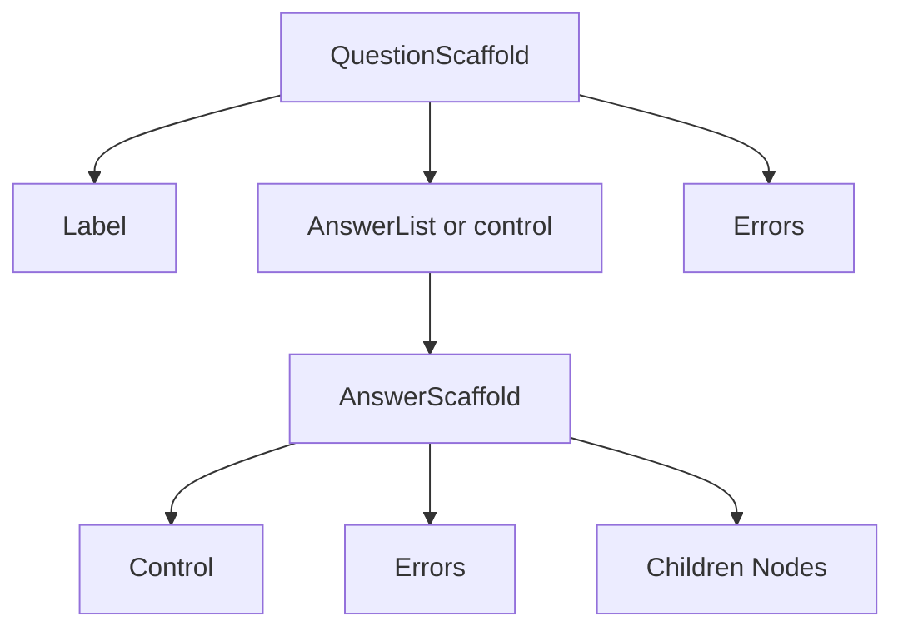
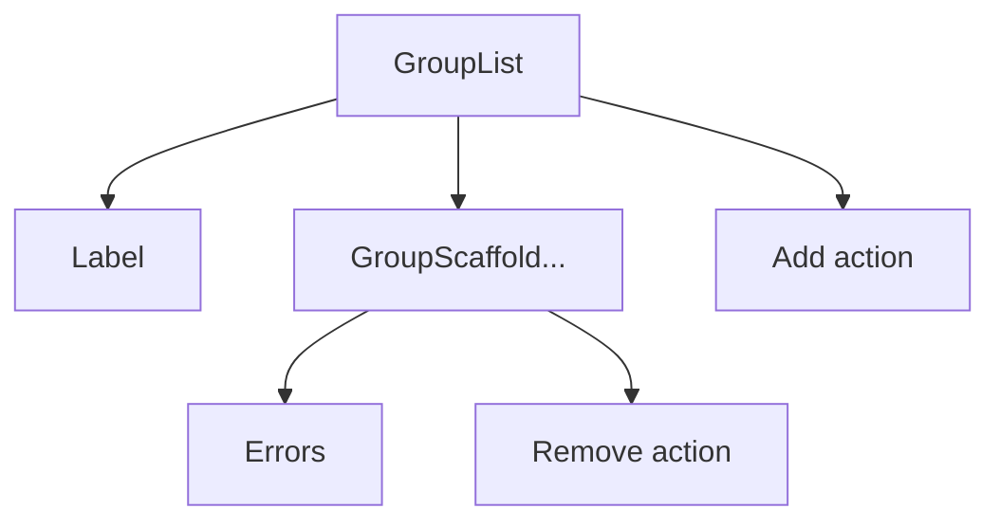

## Install

```bash
pnpm add @aidbox-forms/theme
```

## Quick start

Create a theme by implementing the Theme contract. You can start from a base theme and override only what you need.

```tsx
import type { Theme } from "@aidbox-forms/theme";
import Renderer from "@aidbox-forms/renderer";
import { theme as baseTheme } from "@aidbox-forms/hs-theme";

const theme: Theme = {
  ...baseTheme,
  Label: MyLabel,
};

<Renderer questionnaire={questionnaire} theme={theme} />;
```

## Theme contract

A Theme is a full object with React components for every slot listed in the component reference. The renderer never
touches DOM APIs directly, so the theme is responsible for markup, layout, and styling while keeping the data flow
purely through props.

You may create a complete theme from scratch or extend an existing one with object spread. The Theme type is strict, so
every component must be provided.

## Conventions

- Controlled props: text/number/date inputs use value and onChange. Single-selects pass selectedOption, multi-selects
  pass selectedOptions with onSelect/onDeselect, and checkbox lists use tokens for the selected set. onChange receives
  the next value, never a DOM event.
- Disabled states: the renderer uses disabled to indicate non-editable inputs. Prefer disabled over readOnly in theme
  components.
- Accessibility: ariaLabelledBy and ariaDescribedBy are string ids. Wire them to the relevant elements.
- Ids: when id is provided, pass it through to the focusable control.
- children is the slot name for single content. Option data types use label for the display content.
- Optional = Yes means the renderer may omit the prop at runtime; Optional = No means it is always passed. Treat undefined as not provided.

## Renderer composition overview

The renderer composes your theme in a predictable tree. You control layout, but the nesting explains where headers,
errors, and actions appear.

Overview diagram (simplified):



Group list composition for repeating groups:



Typical question node:

```text
QuestionScaffold
  Label
  AnswerList (or a single control)
    AnswerScaffold (per answer)
      control (TextInput/Select/etc.)
      remove action (when onRemove is provided)
      children (nested nodes)
      errors (Errors)
  Errors (question-level)
```

Typical repeating group list:

```text
GroupList
  Label (only when list has text)
  GroupScaffold (per instance)
    remove action (when onRemove is provided)
    errors
  add action (when onAdd is provided)
```

Typical non-repeating group:

```text
GroupScaffold
  Label (when visible)
  Stack (child nodes)
  Errors
```

## Renderer guarantees

- `id`, `ariaLabelledBy`, and `ariaDescribedBy` values are unique within a form render and stable for a given node or
  answer instance.
- `ariaDescribedBy` strings are already space-joined; use them as-is.
- Option tokens are stable across renders; selected options may remain when the option list changes.
- When needed, the renderer passes disabled legacy options so stored answers can still render.
- `label` and `children` props are ready-to-render `ReactNode` values.
